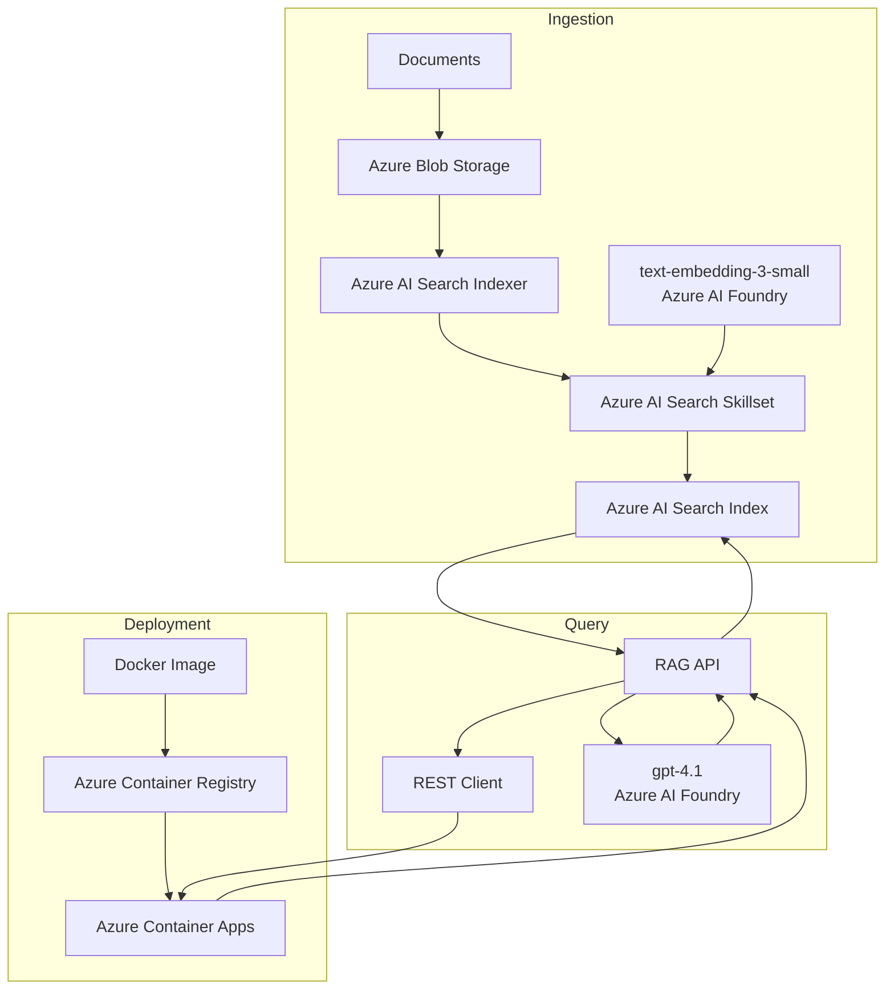

# Azure Cloud-Native RAG

End-to-end **Retrieval-Augmented Generation (RAG)** pipeline built with Azure AI services and deployed as a containerized application.

Documents are stored in **Azure Blob Storage** and processed by an **Azure AI Search indexer and skillset**. The skillset handles document chunking and embedding generation using `text-embedding-3-small` deployed through **Azure AI Foundry**. The resulting vectors are stored in an Azure AI Search index for retrieval.

The query layer uses `gpt-4.1` through **Azure AI Foundry** and exposes the RAG pipeline through a **REST API**. The application is containerized with Docker, published to **Azure Container Registry**, and deployed on **Azure Container Apps**.

## Architecture

## Pipeline

1. **Ingestion**: Documents are uploaded to Azure Blob Storage.
2. **Processing**: Azure AI Search indexes the documents through a skillset.
3. **Chunking & embedding**: Content is chunked and embedded using `text-embedding-3-small`.
4. **Indexing**: Text and vector representations are stored in Azure AI Search.
5. **Containerization**: The REST API is packaged as a Docker image and pushed to Azure Container Registry.
6. **Deployment**: The container is deployed to Azure Container Apps.
7. **Retrieval & generation**: REST requests trigger retrieval from Azure AI Search and response generation with `gpt-4.1`.

## Azure Services

* **Azure Blob Storage**: document storage
* **Azure AI Search**: indexing and retrieval
* **Azure AI Foundry**: embedding and LLM deployments
* **Azure Container Registry**: Docker image registry
* **Azure Container Apps**: application hosting
* **GPT-4.1**: response generation
