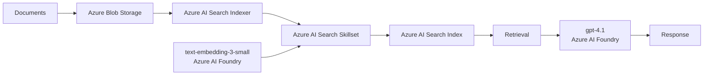

# Azure Cloud-Native RAG

End-to-end **Retrieval-Augmented Generation (RAG)** pipeline built with Azure AI services.

Documents are stored in **Azure Blob Storage** and processed by an **Azure AI Search indexer and skillset**. The skillset handles document chunking and embedding generation using `text-embedding-3-small` deployed through **Azure AI Foundry**. The resulting vectors are stored in an Azure AI Search index for retrieval.

The querying uses `gpt-4.1` through **Azure AI Foundry** to generate responses from retrieved context.

## Architecture

## Pipeline

1. **Ingestion**: Documents are uploaded to Azure Blob Storage.
2. **Processing**: An Azure AI Search indexer processes the documents through a skillset.
3. **Chunking & embedding**: Content is chunked and embedded using `text-embedding-3-small`.
4. **Indexing**: Text and vector representations are stored in Azure AI Search.
5. **Retrieval & generation**: Retrieved context is passed to `gpt-4.1` for response generation.

## Azure Services

* **Azure Blob Storage**: document storage
* **Azure AI Search**: indexing and retrieval
* **Azure AI Foundry**: embedding and LLM deployments
* **GPT-4.1**: response generation
